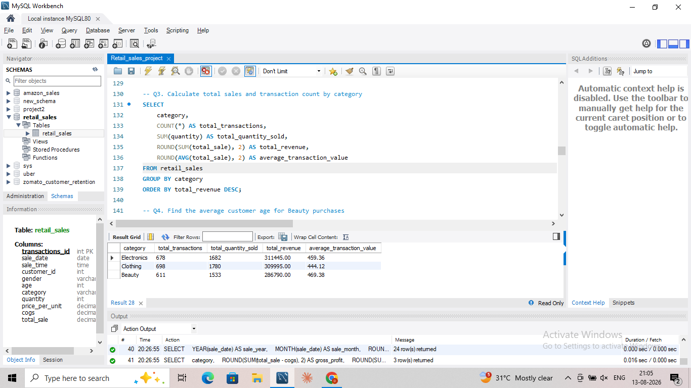
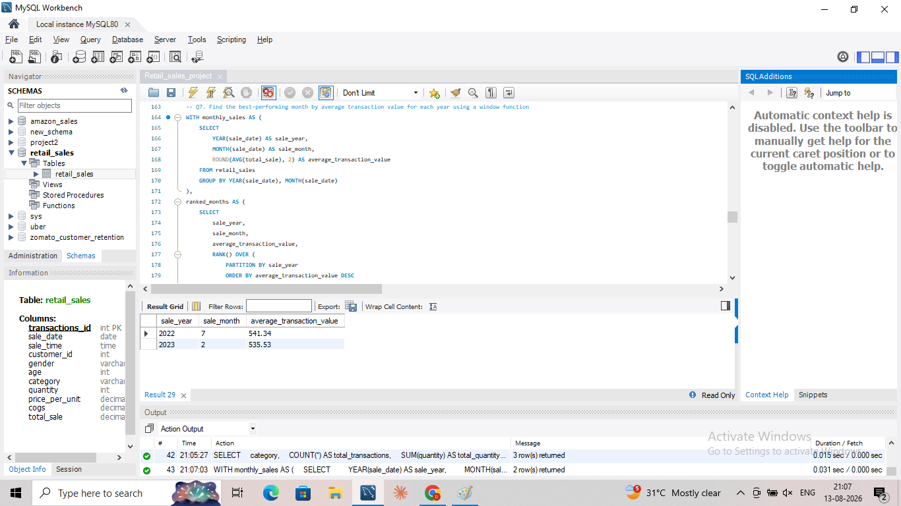
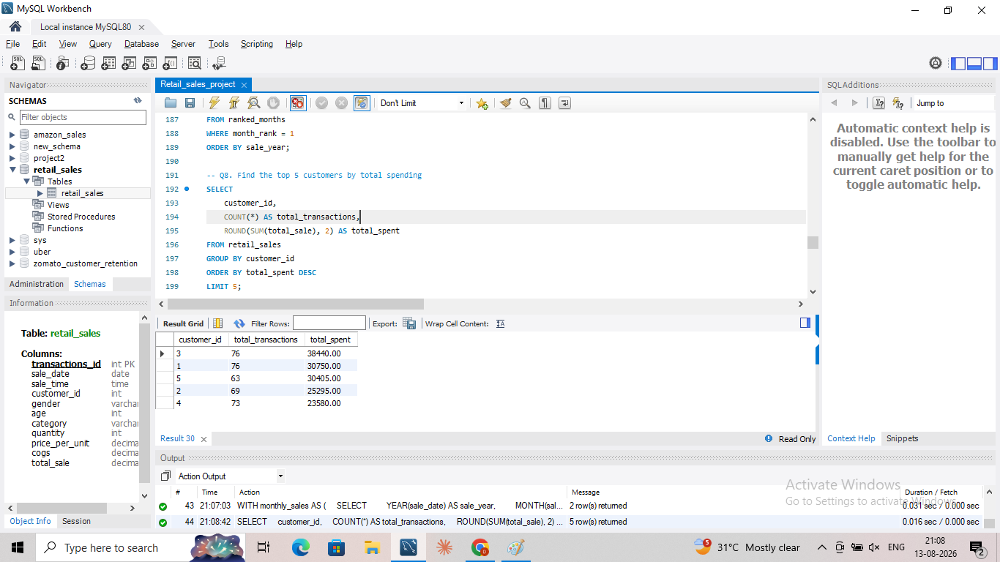
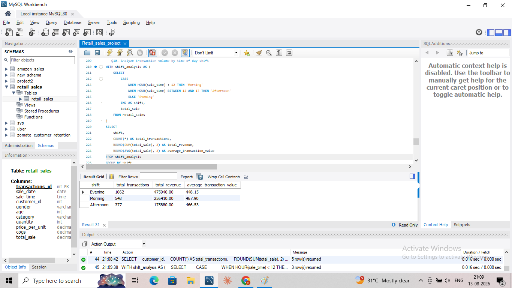

# 🛍️ Retail Sales SQL Analysis

**SQL-driven retail analytics case study using MySQL to turn raw transactions into validated sales, customer and profitability insights.**

## 🎯 Business Problem

Retail teams need to understand **which categories drive revenue, where purchasing volume is concentrated, which customers are most valuable, when demand peaks, and which categories contribute the most profit.**

Workflow:

**Raw Data → Data Cleaning → Data Validation → SQL Analysis → Business Insights**

## 📊 Dataset Snapshot

| Metric | Result |
|---|---:|
| Raw transactions | **2,000** |
| Valid transactions | **1,997** |
| Unique customers | **155** |
| Categories | **3** |
| Period | **2022–2023** |
| Missing age values | **10** |

Categories: Electronics, Clothing and Beauty.

## 🔍 Data Cleaning & Validation

The raw dataset contained **3 transactions with missing core sales fields**: quantity, price per unit, COGS and/or total sale. These records were excluded because the missing financial values could not be reliably imputed.

The **10 missing age values were retained as NULL** because age was not required for revenue or profitability calculations.

Validation also checks whether:

`total_sale = quantity × price_per_unit`

This ensures financial analysis is based on internally consistent transaction values.

## 🧮 SQL Analysis

The project contains **13 business analyses** covering:

- Category revenue and transaction performance
- Customer purchasing behavior
- High-value customers and transactions
- Gender/category comparisons
- Monthly sales trends
- Revenue contribution by category
- Time-of-day performance
- Gross profit by category

### SQL techniques demonstrated

`GROUP BY` · Aggregations · `CASE WHEN` · CTEs · Subqueries · Window functions · `RANK()` · `PARTITION BY` · Date/time functions · Revenue and gross-profit calculations

## 💡 Key Business Insights

### 1. Electronics leads revenue while Clothing leads volume

| Category | Transactions | Quantity | Revenue |
|---|---:|---:|---:|
| Electronics | 684 | 1,698 | **₹313,810** |
| Clothing | **701** | **1,785** | ₹311,070 |
| Beauty | 612 | 1,535 | ₹286,840 |

**Finding:** Electronics generated the highest revenue, while Clothing generated the highest transaction volume and quantity sold.

**Business implication:** Transaction volume does not automatically translate into revenue leadership, so category decisions should consider both volume and transaction value.

**Recommendation:** Prioritize inventory and promotional planning for Electronics while investigating how Clothing converts its higher volume into incremental revenue.

### 2. Evening is the largest transaction-volume period

| Shift | Transactions | Revenue | Avg. Transaction Value |
|---|---:|---:|---:|
| Evening | **1,062** | **₹475,940** | ₹448.15 |
| Morning | 558 | ₹259,900 | ₹465.77 |
| Afternoon | 377 | ₹175,880 | **₹466.53** |

Evening represents approximately **53% of all valid transactions** and generates the highest revenue, while Afternoon has the highest average transaction value.

**Recommendation:** Ensure sufficient operational and inventory capacity during evening demand peaks while studying higher-value daytime purchases for cross-sell opportunities.

### 3. High-value customers provide a retention opportunity

Customer **3** is the highest-spending customer in the dataset with **76 transactions and ₹38,440 total spending**.

**Recommendation:** Use customer spending and transaction frequency to identify high-value segments for targeted retention and personalization rather than relying only on transaction count.

### 4. Monthly patterns can support planning

The analysis identifies the month with the highest **average transaction value** for each year using a CTE and `RANK()`.

**Important distinction:** This is an average-transaction-value analysis, not a total-revenue ranking. Monthly revenue trends are analyzed separately.

**Recommendation:** Combine monthly revenue, transaction volume and average transaction value when planning promotions and inventory.

## 📈 Business Value

This project demonstrates how SQL can move from **raw transactional data to validated financial metrics, customer segmentation, trend analysis and business recommendations**.

The analysis supports decisions around:

- Category and inventory prioritization
- Promotional planning
- Customer retention
- Peak-period capacity
- Revenue contribution
- Gross-profit optimization

## 📸 Selected Analysis Results

### Category Performance


### Monthly / Best Average Transaction-Value Analysis


### Top Customers


### Time-of-Day Performance


## 🛠️ Tools & Skills

**MySQL / SQL:** Data cleaning, validation, filtering, aggregation, CTEs, subqueries, window functions, ranking and business analysis.

**Business Analysis:** Sales performance, customer behavior, revenue contribution, time-based demand and gross-profit analysis.

## 📁 Repository Structure

```text
retail-sales-sql-analysis/
├── README.md
├── data/
│   └── retail_sales_data.csv
├── sql/
│   └── retail_sales_analysis.sql
└── screenshots/
    ├── category-analysis.png
    ├── best-performing-month.png
    ├── top-5-customers.png
    └── shift-analysis.png
```

## 🚀 Portfolio Takeaway

The project demonstrates a practical SQL workflow: **clean the data, validate financial fields, analyze commercial performance, identify patterns, and translate results into actions.**

**Status: Interview-ready SQL case study.**

## 👤 Author

**Rajan Kumar**  
Data Analyst | SQL | Power BI | Excel | Python
